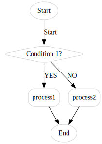

.. _basic_use:

sphinx 基本使用方法
====================

段落
----
段落之间使用空行分隔。
纷纷纷纷

列表
----

无序列表
--------

多级列表要以空行分隔

* itme1
* item2
* item3
  
  * item3.1
  * item3.2

* item4

有序列表
--------
1. item1
2. item2
3. item3
4. item4

   * item4.1
   * item4.2

5. item5

术语定义
--------

注意事项:

* 术语不能超过一行

.. glossary::

   CCR
      恒流调光器.
      
   CST
      高压切换柜.

引用段落
----------

应用段落使用缩进和其他行分隔

    这是一个引用段落

这是另一个包括换行的引用

    | 分纷纷
    | 纷纷纷纷
    | 纷纷

文本块
--------

文本块在结尾处以::标记，这是一个文本块(以：替代)::

    这是一个文本块

::
    
    这是另一个文本块

这是去除末尾的：的文本块 ::

    这是一个文本块

代码块
--------
* 方式1：文本块
  
::

    #include <stdio.h>
    int main()
    {
        printf("Hello, world!\n");
        return 0;
    }

* 方式2：code_block 指令

.. code-block:: c

    #include <stdio.h>
    int main()
    {
        printf("Hello, world!\n");
        return 0;
    }

* 方式3：literalinclude 指令
  
..
    .. highlight:: c
    .. literalinclude:: ../../../application/main.c

>>> print 'this is a Doctest block'
this is a Doctest block

tables
------

* 直接使用
  
=== ===  ===
A   B    C
=== ===  ===
1   2    3
4   5    6
=== ===  ===

* csvtable
  
.. _stu_table:
.. csv-table:: student table
   :header: "Name", "age", "score"
   :widths: 3,2,1
   :align: center
   :width: 50%

    "Alice", 24, 100
    "Bob", 25, 90

* listtable

.. list-table::
   :header-rows: 1
   :widths: 3 2 1
   :align: center
   :width: 50%

   * - Name
     - Age
     - Score
   * - Alice
     - 24
     - 100
   * - Bob
     - 25
     - 90
  
超链接
------

内联外部链接
~~~~~~~~~~~~~

    \`<https://www.python.org/>`_

    \`Python <https://www.python.org/>`_

`<https://www.python.org/>`_

`Python <https://www.python.org/>`_

.. important:: 

    请注意，链接文本和链接地址 ``<`` 字符 必须以空格分隔。

分开目标和定义
~~~~~~~~~~~~~~~~
    请参阅 \`python官网\`_

    \.. _python官网: https://www.python.org/

请参阅 `python官网`_

.. _python官网: https://www.python.org/

内部链接
--------

* ref 指令

    请参阅 :ref:`basic_use`

* doc 指令

    请参阅 :doc:`/index`

使用DOT代码
-----------

  state machine digraph

.. .. raw:: html
..     

.. graphviz::

   digraph G {
       rankdir=LR;
       node [style=rounded, fillcolor=lightblue, color=lightgray];
       Start [ label="Start"];
       Decision [shape=diamond, label="Condition?"];
       Process1 [label="Process 1"];
       Process2 [label="Process 2"];
       Process3 [label="Process 3"];
       End [label="End"];

       Start -> Decision;
       Decision -> Process1 [label="Yes"];
       Process1 -> Process3;
       Decision -> Process2 [label="No"];
       Process3 -> End;
       Process2 -> End;
   }
